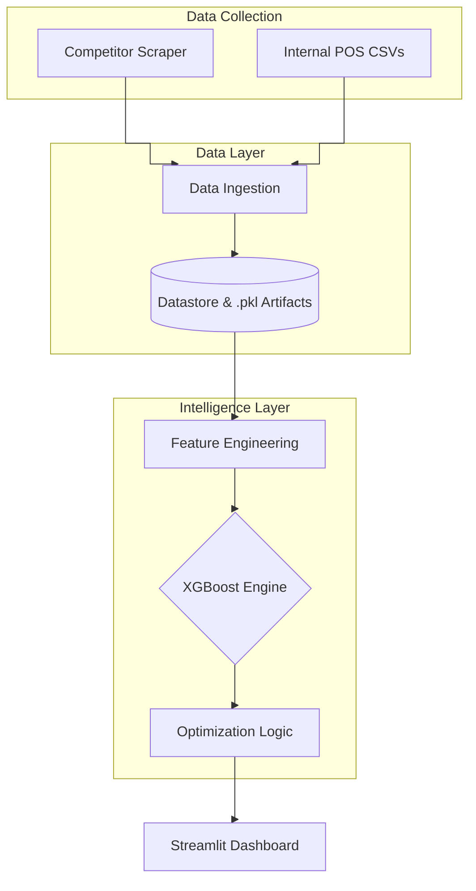

```markdown
# XGBoost Price Optimization Platform 🇰🇪

This is an intelligent price optimization system designed specifically for Kenyan retail SMEs. It utilizes an **XGBoost Gradient Boosting** regressor to predict demand elasticity and prescribes optimal price points to maximize revenue while maintaining competitive market positioning.

## 🚀 Key Features
* **Predictive Demand Modeling:** Achievement of **0.93 R²** and **2.66% MAPE** using XGBoost.
* **Automated Competitor Tracking:** Integrates with Shopify-based retail APIs to monitor live prices.
* **Grid-Search Optimization:** Simulates thousands of price scenarios to find the revenue-maximizing point.
* **Admin Dashboard:** Includes Model Explainability (SHAP), performance monitoring (MAE/RMSE), and RBAC management.
* **Streamlit UI:** An intuitive interface for retail managers to manage inventory pricing.

## 🏗️ System Architecture

The system follows a four-tier decoupled architecture to ensure sub-second inference performance.



## 🛠️ Installation & Setup

### 1. Prerequisites

* Python 3.9+
* Virtual Environment (venv or conda)

### 2. Clone and Install

```bash
git clone [https://github.com/your-repo/dapri-price-optimizer.git](https://github.com/your-repo/dapri-price-optimizer.git)
cd dapri-price-optimizer
pip install -r requirements.txt

```

### 3. Run the Application

```bash
streamlit run app.py

```

## 📊 Model Performance

Our comparative analysis identified XGBoost as the superior architecture for Kenyan retail datasets:

| Model | R² | MAPE | MAE |
| --- | --- | --- | --- |
| **XGBoost** | **0.93** | **2.66%** | **0.07** |
| Random Forest | 0.85 | 10.71% | 0.19 |
| LSTM | 0.88 | 71.04% | 0.29 |

## 📂 Project Structure

```text
├── data/                   # Raw and processed datasets
├── models/                 # Serialized .pkl (XGBoost, Scalers, Encoders)
├── src/
│   ├── scraper.py          # Shopify API integration
│   ├── feature_eng.py      # Lags and Competitor Ratios
│   └── optimizer.py        # Revenue optimization logic
├── app.py                  # Main Streamlit application
└── requirements.txt        # Project dependencies

```

## 📜 License

Distributed under the MIT License. See `LICENSE` for more information.

---

**Developed for IT Thesis Research - 2026**

```

---
 discussed?**

```
