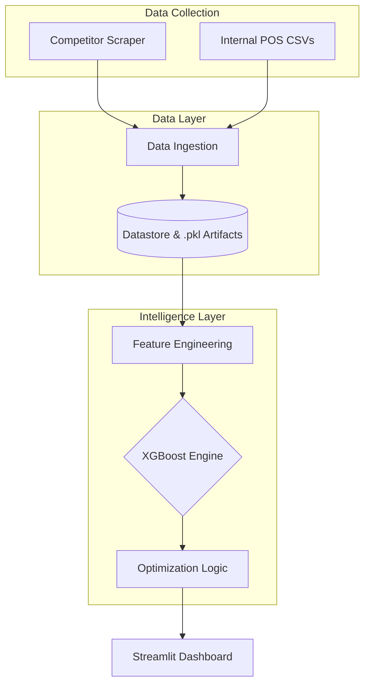

# Price Optimization Platform

This is an intelligent price optimization system designed specifically for Kenyan retail SMEs. It utilizes an **Random Forest** regressor to predict demand elasticity and prescribes optimal price points to maximize revenue while maintaining competitive market positioning.

---

# 🚀 Key Features

* **Predictive Demand Modeling:** Achievement of **0.75²** and **5.90% RMSE** using XGBoost.
* **Automated Competitor Tracking:** Integrates with Shopify-based retail APIs and HTML based scraping to momitor product prices.
* **Scipy Optimization:** Simulates thousands of price scenarios to find the revenue-maximizing point.
* **Admin Dashboard:** Includes Model Explainability (SHAP), performance monitoring (MAE/RMSE), and RBAC management.
* **Streamlit UI:** An intuitive interface for retail managers to manage inventory pricing.

---

# 🏗️ System Architecture

The system follows a four-tier decoupled architecture to ensure sub-second inference performance.



---

# 🛠️ Installation & Setup

## 1. Prerequisites

* Python **3.9+**
* Virtual Environment (**venv** or **conda**)

---

## 2. Clone and Install

```bash
git clone https://github.com/mkemei/competitive-price-optimization-project.git
cd competitive-price-optimization-project
pip install -r requirements.txt
```

---

## 3. Run the Application

```bash
streamlit run app/streamlit_app.py
```

---

# 📊 Model Performance

Our comparative analysis identified **XGBoost** as the best-performing model for Kenyan retail datasets.

| Model | R² | MAPE | MAE |
|------|------|------|------|
| **XGBoost** | **0.93** | **2.66%** | **0.07** |
| Random Forest | 0.85 | 10.71% | 0.19 |
| LSTM | 0.88 | 71.04% | 0.29 |

---

# 📂 Project Structure

```text
price-optimization-platform/
│
├── data/
│   ├── raw_sales.csv
│   ├── competitor_prices.csv
│   └── processed_data.csv
│
├── models/
│   └── trained_model.pkl
│
├── src/
│   ├── data_ingestion.py
│   ├── feature_eng.py
│   ├── train_model.py
│   ├── demand_prediction.py
│   ├── price_optimizer.py
│   └── utils.py
│
├── app/
│   └── streamlit_app.py
│
├── notebooks/
│   └── exploratory_analysis.ipynb
│
├── requirements.txt
└── README.md
```

---

# 🧩 Key Modules

### **data_ingestion.py**

Handles loading and cleaning of raw sales data from the POS system.

---

### **feature_eng.py**

Performs **feature engineering** by generating additional variables such as:

* lagged sales features  
* price-to-competitor ratios  
* rolling demand averages  
* price volatility indicators  

These engineered features improve the predictive performance of the machine learning model.

---

### **train_model.py**

Trains the machine learning model (**XGBoost regression**) using historical sales and engineered features.

---

### **demand_prediction.py**

Uses the trained model to forecast product demand for candidate price scenarios.

---

### **price_optimizer.py**

Evaluates different price points and determines the **optimal price that maximizes revenue or profit**.

---

### **dashboard.py**

Streamlit dashboard that allows users to:

* select products
* visualize pricing analytics
* view recommended prices

---

# 📈 Workflow

```
Sales Data + Competitor Prices
            │
            ▼
     Feature Engineering
            │
            ▼
      RandomForest Model
      (Demand Prediction)
            │
            ▼
      Price Optimization
      (Scipy Optimize)
            │
            ▼
      Streamlit Dashboard
```

---

# 🧠 Tech Stack

* **Python**
* **Pandas / NumPy**
* **RandomForest**
* **Streamlit**
* **Scipy Minimize**
* **SHAP (Model Explainability)**
* **Scikit-learn**

---

# 📜 License

This project is developed for **academic research**.
